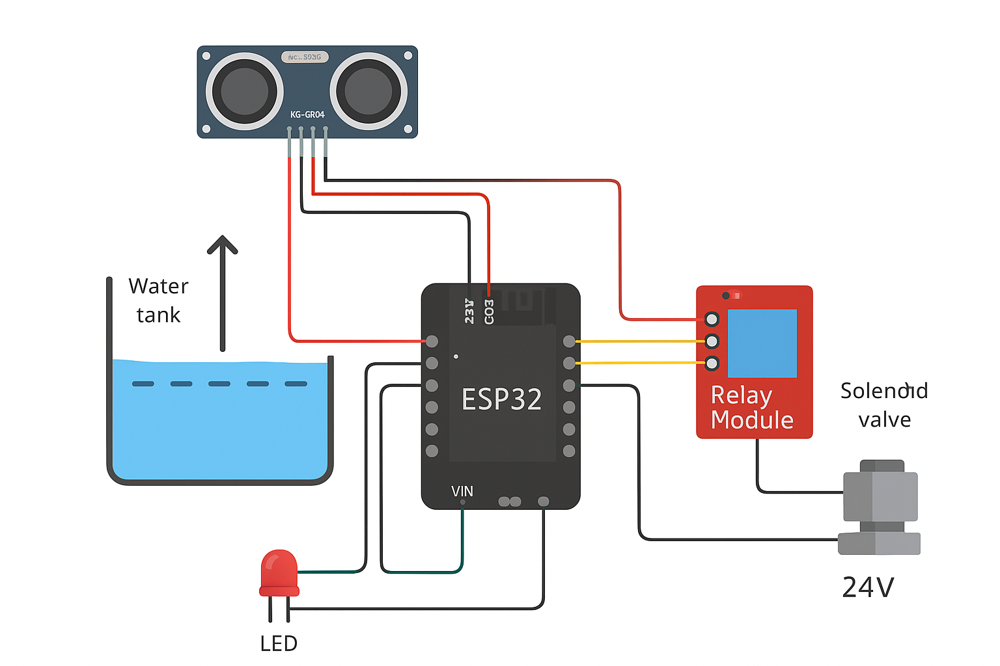

# 🚰 Smart Water Tank Automation System  

An **IoT-enabled water tank monitoring and control system** built using **ESP32, ultrasonic sensors, LoRa/Wi-Fi modules, and solenoid valves**.  
This project prevents water overflow, optimizes filling, and provides **real-time monitoring** via a mobile app or built-in web dashboard.  

---

## 🔧 Features  
- Automated water filling & cut-off using ultrasonic sensors + solenoid valve  
- Real-time monitoring of **water level (cm & %)**  
- Web API (`/status`, `/toggle`, `/set`) + built-in dashboard UI  
- Fail-safe routines for sensor errors & power loss  
- Manual override via mobile app (MIT App Inventor)  
- CAD model for tank and electronics housing  

---

## 🖼️ System Overview  


### Circuit Diagram  
  

---


---

## 💻 Tech Stack  
- **ESP32** (C++ / Arduino IDE)  
- **Sensors:** Ultrasonic HC-SR04, IR  
- **Actuators:** Solenoid Valve (24V), Relay Module  
- **Communication:** Wi-Fi + LoRa  
- **Mobile App:** MIT App Inventor  
- **CAD Tools:** Fusion 360 / SolidWorks  

---

## 📊 Results  
- Reduced water wastage by **20–30%** compared to manual operation  
- Reliable fail-safe with manual bypass & power backup  
- Scalable for **residential, campus, and industrial use**  

---

## 🚀 How to Run  

### Hardware Setup  
1. Connect **HC-SR04 Ultrasonic Sensor** to ESP32 (Trig → D5, Echo → D18).  
2. Connect **Relay Module** to ESP32 (GPIO 26).  
3. Connect **Solenoid Valve** (24V DC) through relay output.  
4. Power ESP32 via USB (5V) and solenoid with separate 24V supply.  

### Software Setup  
1. Clone the repo:  
   ```bash
   git clone https://github.com/Dakshy123er/Smart-Water-Tank-Automation.git
   cd Smart-Water-Tank-Automation/code
